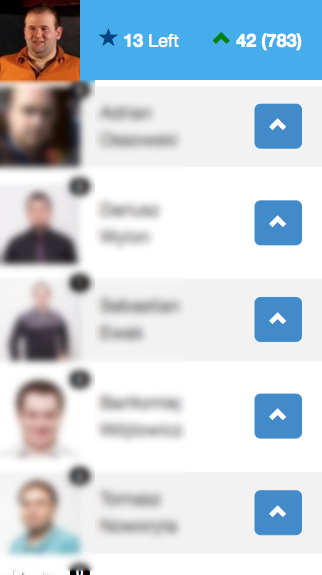
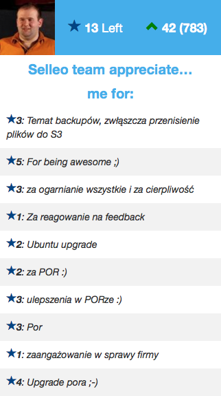
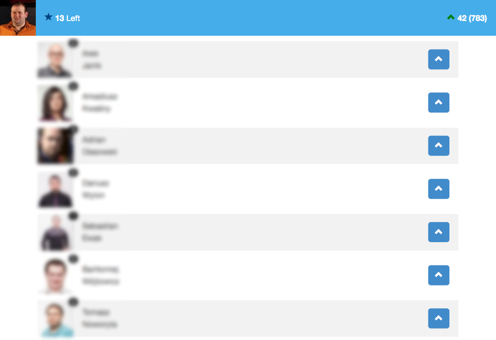
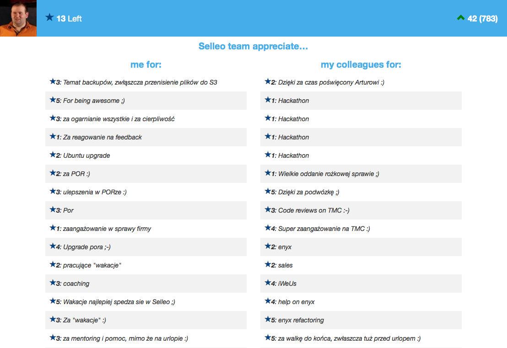
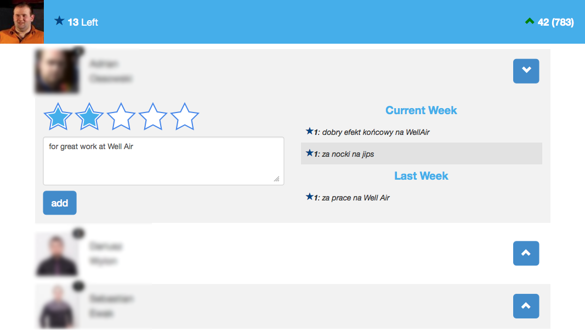

h1. Merit Money

more info about Merit Money -> http://www.management30.com/workout/merit-money/

__

This is application for giving 'kudos' to co-workers. Every Monday morning each co-worker is getting 20 'kudos'.
She has to give the 'kudos' to other co-workers. Undistributed 'kudos' are lost on Sunday at midnight.

User after authorization using google account, is redirecting to main screen. On the main screen is visible

* progress
** haw many 'kudos' left
** how many days left until current period
* all co-workers (including himself), and for each co-worker
** how many 'kudos' she received in current week from others
** how many 'kudos' she gave others

h2. Scenarios

h3. Authentication

* Successful authentication with Google Account
* Unsuccessful authentication with Google Account

h3. Giving Kudos

* Pressing co-worker image for 3 seconds result in giving kudos when they are still left
* Clicking co-worker image when there is no 'kudos' left, show error notice - that you can't

h2. Ruby on Rails

This application requires:

* Ruby version 1.9.3
* Rails version 3.2.12

h2. Database

This application uses SQLite with ActiveRecord.

h2. Development

* Template Engine: ERB
* Testing Framework: RSpec and Factory Girl
* Front-end Framework: Twitter Bootstrap (Sass)
* Form Builder: SimpleForm
* Authentication: OmniAuth

h2. Email

The application is configured to send email using a Gmail account.

h2. Getting Started

* Install rvm and ruby 1.9.3
* Fetch repository and run bundle
* cp config/database.yml.example config/database.yml
* rake db:create
* rake db:migrate
* run rails s

h2. Documentation and Support

***

h2. Credits

***

h2. License

MIT
